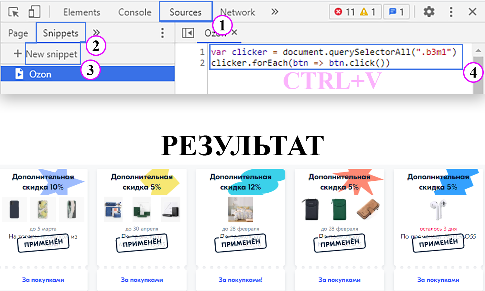

# Coupons_clicker_for_ozon
Принцип работы (для google chrome):
>1. переходим по ссылке: https://www.ozon.ru/info/coupon/
>2. совершаем вход под своей учеткой;
>3. жмём F12 или CTRL+SHIFT+I
>4. в панеле "Elements, Console, ..." выбираем "Sources";
>5. в панеле "Page, FileSystem, ..." выбираем "Snippets";
>6. жмём "New snippet" и в поле справо вводим код скрипта;
>7. жмём правой кнопкой мыши по сниппету слева и выбираем "Run" / выделяем скрипт и жмём CTRL+ENTER;
>8. завершением отработки скрипта следует считать переход со страницы промокодов на страницу товаров;
>9. закрываем страницу озона, ибо скрипт будет продолжать отрабатываться и может повесить систему.
>
